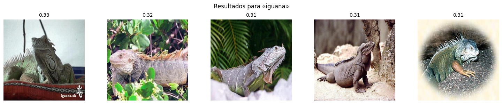
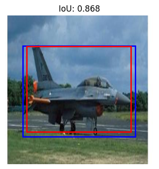

# Visión por Computador – Talleres EAFIT 2025

Este repositorio agrupa los cinco talleres del curso **SI7004_6621_2561: Visión por Computador** de la Maestría en Ciencias de Datos (Universidad EAFIT). Cada carpeta incluye los notebooks ejecutados y los datos mínimos necesarios para reproducir los resultados.

## Estructura

- **Taller 01 – Clasificación de Enfermedades de Mango**  
  Desarrollo de un clasificador SVM sobre imágenes de hojas de mango enfermas.  
  - **Resultados:**  
    - Exactitud (accuracy): 77 %  
    - F1-score global: 0.77  
    - Precisión > 90 % para algunas clases  

- **Taller 02 – Clasificación con AutoGluon**  
  Implementación de un pipeline automático con AutoGluon para clasificación de imágenes (inferencia sobre features extraídos con CNN).  

- **Taller 03 – ViTT: Recuperación Texto→Imagen**  
  Fine-tuning ligero de un Transformer multimodal para búsqueda texto→imagen.  
  - **Resultados:**  
    - Recall@5 global: de 74 % → 87 % tras 3 épocas  
    - Clase “hot dog”: de 42 % → 78 %  

  

- **Taller 04 – Modelos Fundacionales y Tareas de Pretexto**  
  Exploración de arquitecturas auto-supervisadas (e.g., masked autoencoders) y tareas de pretexto para aprendizaje de representaciones en visión por computadora.  

- **Taller 05 – Detección de Aviones y Coordenadas**  
  Entrenamiento de un modelo de detección de objetos (bounding boxes) para identificar aviones en imágenes aéreas.  
  - **Resultados:**  
    - IoU en validación: 0.82–0.91  

  

## Guía de uso

1. **Clonar el repositorio**  
   ```bash
   git clone https://github.com/Vagarh/Procesamiento_Imagenes_curso_eafit_2025.git
   cd Procesamiento_Imagenes_curso_eafit_2025
